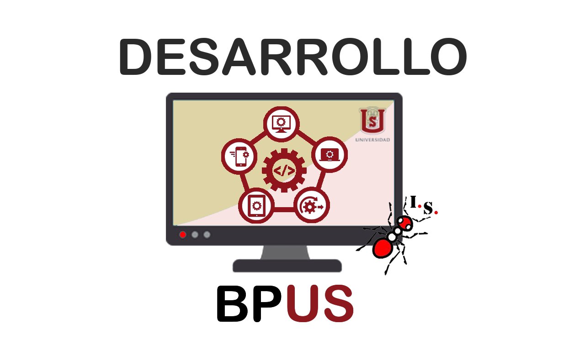
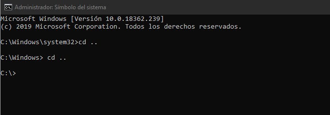
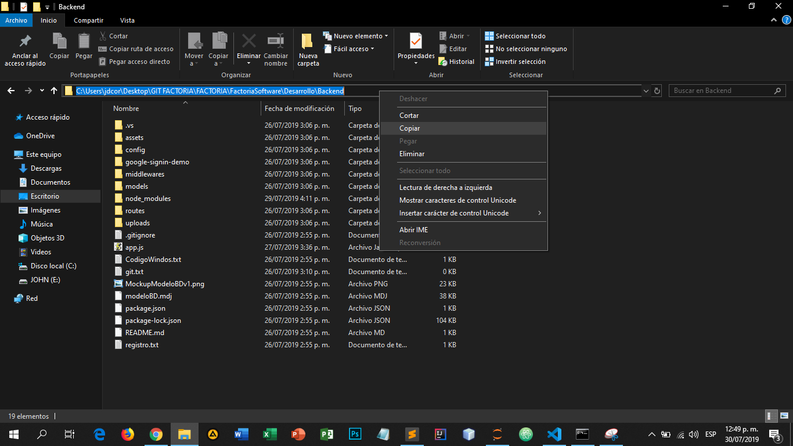
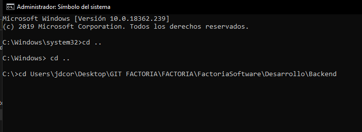
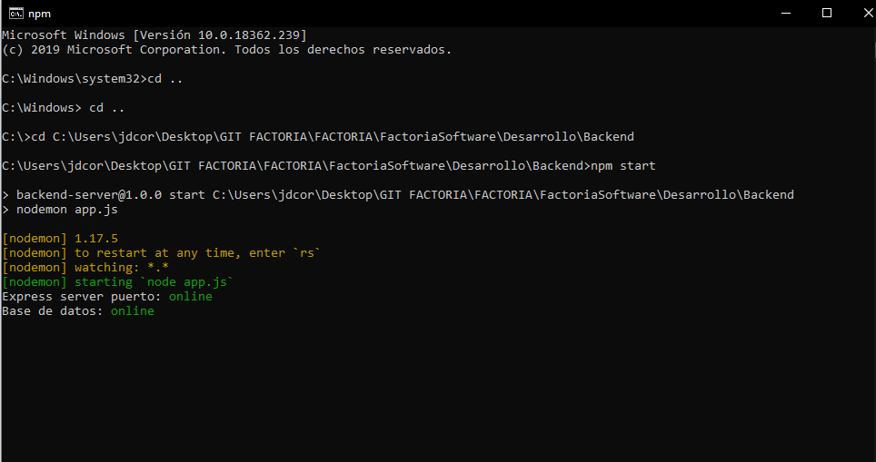

# Factoría Software Equipo de Desarrollo

## Integrantes:

- Julián Andrade (Lider)
- Daniel Velásquez (Scrum master)
- John Guerrero (Product owner)
- Karen Esquivel
- Jorge Cutiva

# Instrucciones para la ejecución del sistema BPUS

## Instalaciones necesarias y pasos a seguir

- 1) Node JS https://nodejs.org/es/ - instalación fácil y sencilla solo sigan los pasos.
- 2) MongoDB https://www.mongodb.com/download-center/community - según las características de su equipo.
- 3) GitLocal https://git-scm.com/downloads - según las características de su equipo.
- 4) Una vez instalado Git, creamos una carpeta para almacenar nuestro proyecto, accedemos a la carpeta creada, damos click derecho dentro de la carpeta y seleccionamos la opcion Git Bash Here.
- Esto ejecutará una consola de Git, dentro de ella colocamos el comand 'git clone https://github.com/uscofactoriasoftware150833/FactoriaSoftware.git' sin las comillas simples, damos enter y esperamos que descargue el repositorio.
- 5) Una vez clonado, entramos a la carpeta FactoriaSoftware luego a la carpeta Desarrollo.
- Las dos carpetas importantes para la ejecución serán BPUS (la parte de Frontend) y Backend (valga la redundancia la parte de backend)
- 6) Las siguientes instalaciones se realizarán desde la consola de comandos de Windows (CMD) ejecutada como administrador.
- 7) Empezaremos con iniciar el Backend, desde la consola de comandos nos dirigimos con el comando 'cd ..' sin las comillas, hastas la raíz.

- 8) Luego vamos a la ruta de nuestro backend en el CMD, para ello, dentro de la carpeta backen copiamos la ruta que se muestra en nuestro explorador de archivos

- 9) Dentro del CMD colocamos cd y pegamos la ruta del backend y borramos 'c:\\' del inicio de la ruta pegada

- 10) Damos enter, y ya dentro de la ruta colocamos el comando 'npm start', debería arrojar algo similar a esta pantalla

- 11) Si la ejecución obtenida se asemeja la pantalla anterior, los pasos fueron ejecutados exitosamente. En caso contrario rectifique los pasos anterirores.
- 12) Ahora vamos a ejecutar el frontend, para ello nos dirigimos a la carpeta BPUS desde la terminal como lo hicimos con los pasos (6,7,8 y 9), con la diferencia de que partimos desde la carpeta BPUS
- 13) Una vez en la carpeta BPUS en la terminal colocamos el comando 'npm install -g @angular/cli @7.3.9'
- 14) Luego el comando 'npm install --save @ng-bootstrap/ng-bootstrap'
- 15) Luego 'npm i ngx-dropzone'
- 16) Una vez instalados estos modulos, procedemos a ejecutar el frontend con el comando 'ng serve -o'
- 17) Después de compilar el proyecto se abrira el navegador por defecto que tengan con la página 'http://localhost:4200' si les aparece error, podrían reportarlo en el grupo para que alguno de desarrollo los asesore.